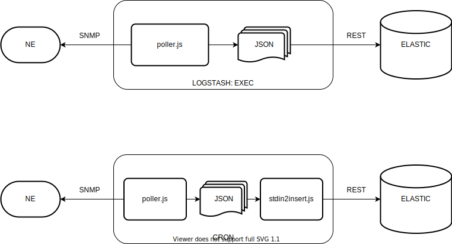

# SNMP-COLECT

Is a script written in NODE JS, to collect SNMP data from any kind of network element, can collect SNMP information from thousands devices with many and different type of OID.
The JSON output is formatted to work perfectly with Logtsash to send the data to Elasticsearch.
The JSON input configuration file, has some similarities with Telegraph SNMP plugin; the object structure inherits from Telegraf, but its tested to work for 2K network devices with 30K interfaces sending the data to Elasticsearch in less a minute, whiteout a problem or loss of data.
The use of CPU of server that run the script is very low.
We create this program in replace to use telegraph, because not work as we need in scenario of thousands devices with many OID.
Now we can do more with less CPU resources

## What Can DO

- collect data from group of OID than have the same index, like table. Example “if-mib”.
- add inherit data form different OID to any group of data in table format. Example “hostname”, “syslocation”.
- identified the data, its added the measurement_name field with a text name, like a table name in databases.
- work with SNMP v1 and v2c
- separate the data in two objects “field” and “tag”, this is useful when in the index of Elasticsearch you make all field.X as not index data and all tag.X indexed.
Example: the ifHCInOctets (if-mib) that are a counter and is not useful to index and has a cost of disk this index action.
- poller-cm.js have a filter of OID config using OUI of MAC, beacasue its used for HFC cable modems

## Cnfiguration JSON File

>The configuration input file are divided in:

- Information of hosts and SNMP options.
- Inherit OIDS, OIDS with only one response that will be repeted in all responses from tables (example hostname)
- Tables, OIDS that have the same INDEX like if-mib, can configure many tables any table with especifict measurement.
- OIDS_GET, OIDS that response only one value, can parse STRING into multiple object usin a REGEX.
- OIDS_WALK, OIDS that response many values, store the results in array.

>Examples:

- examples/conf_table.json -> multiple OID/Table for 2 devices
- examples/conf_getinfo.json -> get many simple values for 2 devices
- examples/config_dbconect.json -> get info from a list provided by database
- examples/cable_modems.json -> config file for HFC CableModems. poller-cm.js
- examples/vendor-list.json -> config for vedors OUI MAC, to filter OIDs to poller. poller-cm.js

>Data processing:

Configuration inside of OID context:

- "type": [ hex, regex ] transform value in hex to string or split the result using a regular expresion, has to define "regex"
- "conversion": [ ipv4, number ] transform value in ipv4 or number
- "index_slice": [ int, int ] apply slice function to oid index (only for table)
- "regex": string of regular expresion to use
- "map": array of name of fields result of regex convertion usin the $ positions
- "split": define the split string to split the string result in array

## Execution

- Collect data from list of equips
    node poller.js --config=conf/conf.json

- Collect data from HFC CMTS / Cable Modems
    node poller.js --config=conf/conf_cmts.json | poller-cm.js --config=conf/conf_cm.json

## Release Notes

Version 1.0:

- list of hosts by file
- suport octect 64bits
- multiple tables
- inherit data to all tables
- suport HEX OCTECTSTING
- OID type get, with response STRING cab be parsed to many objects by REGEX (typical use SYSDESCRIP)

Version 1.1:

- add convert ipv4 from hex or integer to string
- poller-cm.js support snmpwalk OID to array

Version 1.2:

- add convert string response to number
- add input of list of hosts from text file, each IP by line

Version 1.3.0:

- add input list of hosts from DB conection (mysql or mariadb "mysql" and pgsql "pg")
- add inpit list of hosts from stdin (to execute from result of another script)
- update modules
- remove async module, use async/await and promisses

Version 1.3.1

- minor release, correct bug of first field with prefix (field or tag) duplicated

Version 1.3.2

- update npm modules
- correct bugs:
  - ipiterate in database read if is in dot notation
  - add deepmerge in objects
  - add snmptest at target to reduce the poller time when not responding

Version 1.3.3

- correct bugs:
  - snmptest override snmp.options

Version 1.3.4

- Feature:
  - get_table/index_slice add slice function to index per OID in Table
  - update README

Version 1.3.5

- Feature:
  - add split function to strig response to return array, can be used with conversions

- correct bugs:
  - bug table snmperror

## Requests

- unify poller.js and poller-cm.js
- add support for mongodb
- output can be elasticsearch directly

***

## Diagram of Use

